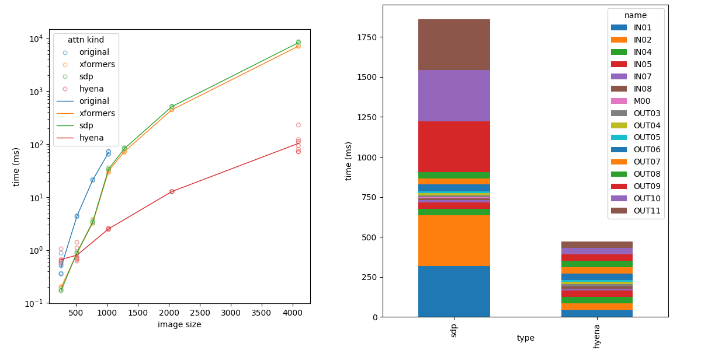
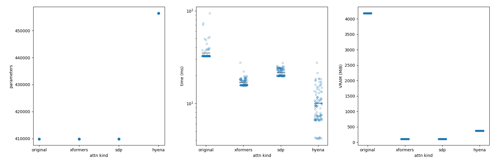

# Stable Diffusion with Hyena

Stable-diffusion self-attention layers replacement with [Hyena](https://github.com/HazyResearch/safari).




## Installation

```bash
# install sd-hyena and submodules (safari and its submodules)
$ git clone --recursive https://github.com/hnmr293/sd-hyena.git 
$ cd sd-hyena

# create virtual env and install required libraries
$ python -m venv .venv --prompt "sd-hyena"
$ . .venv/bin/activate
(sd-hyena) $ pip install torch xformers
(sd-hyena) $ pip install -r requirements.txt
(sd-hyena) $ cd safari
(sd-hyena) $ pip install -r requirements.txt

# optional

## 1. fused_dense_lib
(sd-hyena) $ cd safari/flash-attention/csrc/fused_dense_lib
(sd-hyena) $ pip install .

## 2. fftconv
(sd-hyena) $ cd safari/flash-attention/csrc/fftconv
(sd-hyena) $ pip install .
```

## Training

See `examples/train.sh`.

### Training options

| short | long | default | description |
| --- | --- | --- | --- |
| `-m` | `--teacher_model` | (required) | the model which generates training data |
| `-t` | `--target` | `'IN91'` | specify the attention module to train; one of `IN01` `IN02` `IN04` `IN05` `IN07` `IN08` `M00` `OUT03` `OUT04` `OUT05` `OUT06` `OUT07` `OUT08` `OUT09` `OUT10` `OUT11`. |
| `-b` | `--batch_size` | `16` | batch size
| `-r` | `--lr` | `1e-5` | learning rate; currently AdamW is used as an optimizer. |
| `-n` | `--n_steps` | `200` | training steps |
| `-W` | `--width` | `512` | image width used to compute latent shape for training |
| `-H` | `--height` | `512` | image height used to compute latent shape for training |
| `-s` | `--save_every_n_steps` | `40` | the step which trained model will be saved. set 0 to disable saving |
| `-l` | `--log_dir` | `'logs'` | tensorboard logging directory |
| `-o` | `--out_dir` | `'out'` | model saving directory |
| `-f` | `--name_format` | `'Hyena-{s:05d}'` | the name of the model to be saved; `{s:...}` will be replaced with training steps. |
| `-d` | `--seed` | `-1` | seed value |
| `-p` | `--pretrained_weight` | `''` | specify hyena model which has been trained before |

## Generation

See `examples/generate.sh`.

### Generation options

| short | long | default | description |
| --- | --- | --- | --- |
| `-m` | `--model` | (required) | the model to generate the images. |
| `-y` | `--hyena` | `''` | path to the Hyena module to replace original self-attention module. comma(,)-separated |
| `-t` | `--target` | `'IN01'` | specify the attention module to replace with Hyena; one of `IN01` `IN02` `IN04` `IN05` `IN07` `IN08` `M00` `OUT03` `OUT04` `OUT05` `OUT06` `OUT07` `OUT08` `OUT09` `OUT10` `OUT11`. |
| `-p` | `--prompt` | (required) | the prompt to generate the images. |
| `-q` | `--negative_prompt` | `''` | the negative-prompt to generate the images. |
| `-W` | `--width` | `512` | image width |
| `-H` | `--height` | `512` | image height |
| `-n` | `--num_images` | `4` | the number of images to generate at single iteration. |
| `-s` | `--steps` | `30` | diffusion steps |
| `-c` | `--cfg_scale` | `7.0` | classifier-free guidance scale; set 0 to disable CFG. |
| `-i` | `--iteration` | `1` | the number of iterations. the number of images will be `num_images * iterations`. |
| `-k` | `--seed` | `-1` | seed value |
| `-o` | `--out_dir` | `./` | image saving directory |
| `-f` | `--name_format` | `'image_{n:03d}'` | the name of the image to be saved; `{h}` is the index of the hyena module, `{n}` is the index of the image; `{b}` is the number of the iteration, `{i}` is the index of the image in the iteration. |

## Benchmark 1

### Conditions

```
module: IN01
batch size: 8
image size: 512x512
input shape: (4096, 320)
output shape: (4096, 320)
Hyena hparams: d_model=320, l_max=4096 and default values for all other parameters
```

### Parameters, inference time and memory usage



The number of the parameters in the attention module and the Hyena module (left), the inference (`forward` calling) time (centre) and VRAM usage (right) are shown. Each points are the mean of the result of 10 times `forward` callings. `time (ms)` (centre) and `VRAM (MiB)` (right) is the result of 100 iterations. The y-axis of `time (ms)` (centre) is shown in log-scale.

Hyena module has roughly same number of the parameters as the attention module. And, inference speed is very fast (2x or faster) compared to `xformers` or `scaled-dot product`. VRAM usage is a bit larger than those attention manners.

### Image size vs. performance


The number of the parameters (left), the inference time (centre) and VRAM usage (right) with image size (width; px) are shown. Each points are the mean of the result of 10 times `forward` callings. `time (ms)` (centre) and `VRAM (MiB)` (right) is the result of 10 iterations. The y-axis of `time (ms)` (centre) is shown in log-scale.

With larger latent, Hyena needs lots of the parameters. It will make model size larger, and the training may be hard. On the other hands, inference speed is very hopeful. For 4096x4096 image size, Hyena is *100x* faster than `xformers` and `scaled-dot product`. Unfortunately, VRAM usage is a bit larger. Note that these time and VRAM results are evaluated with only `IN01` module.

## Benchmark 2

### Conditions

```
module: IN01, IN02, OUT09, OUT10, OUT11
batch size: 1
image size: 2048x2048
```

### Inference time of the performance-critical layer


The computational complexity of the self-attention is proportional to the square of the context length. When the size of the generating image is `(w, h)`, the input size of the self-attention layer for `IN01`, `IN02`, `OUT09`, `OUT10`, and `OUT11` will be `(320, w//8 * h//8)`, and the context length is more than 4 times larger than the other self-attention layers. Therefore, these layers are likely to become performance bottlenecks. So I replaced these layers with Hyena. As a result, performance was extremely improved.

When the self-attention layers of IN01, IN02, OUT09, OUT10 and OUT11 were replaced with Hyena, performance was significantly improved. 
